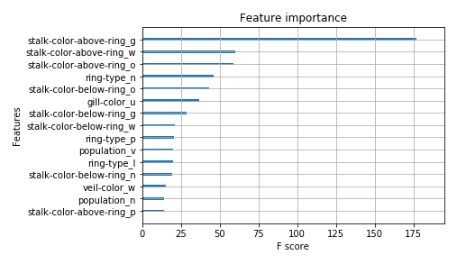

# Mushroom Classification Project 

## Description
This project aims to **identify mushrooms toxicity based on easily observable characteristics** such as cap color, stem color, gill size, etc. Each feature is categorical and easily observable if one knows what to look for. The data comes from a hypothetical dataset drawn from [The Audubon Society Field Guide to North American Mushrooms](https://www.kaggle.com/uciml/mushroom-classification) (1981). 

""

## Results
Since avoiding toxic mushrooms is the number one goal, my _metric for success was #recall#_ (the target is coded as 1 (poisonous or unknown) and 0 (definitely edible)). With this metric, I acheived a recall rate of 99.7% using either a random forest or XGBoost model. Observing the feature importance metric used in the XGBoost model, we see that the stalk color above the ring was the most significant feature in determining toxicity for the mushrooms in this sample. 

## Further Reading
The findings were presented to my bootcamp class in this [presentation]( https://drive.google.com/open?id=11ccNHS3ZSeqOpk0b0xu7EZjTV0ZqcCnWi_5yodFI7Os). 

To learn more about the two mushroom species used to make this data set, you can read about them here: [Genus: Agaricus](https://en.wikipedia.org/wiki/Agaricus) and [Genus: Lepiota](https://en.wikipedia.org/wiki/Lepiota).

## Technologies Used 
- Jupyter Notebook
- Python
    - Pandas
    - SciPy
    - Statsmodels
    - Seaborn
    - Matplotlib
    - SKlearn
    - XGBoost
